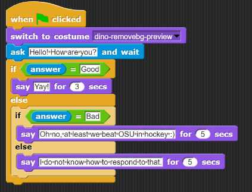
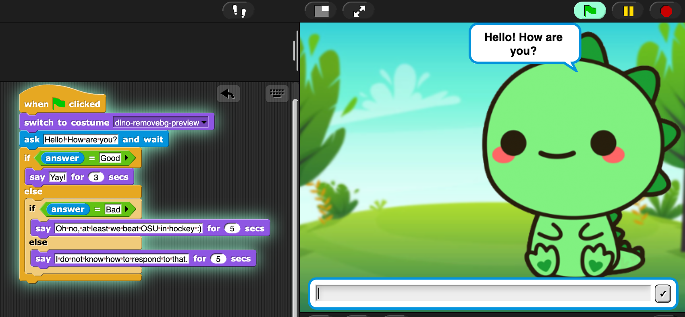
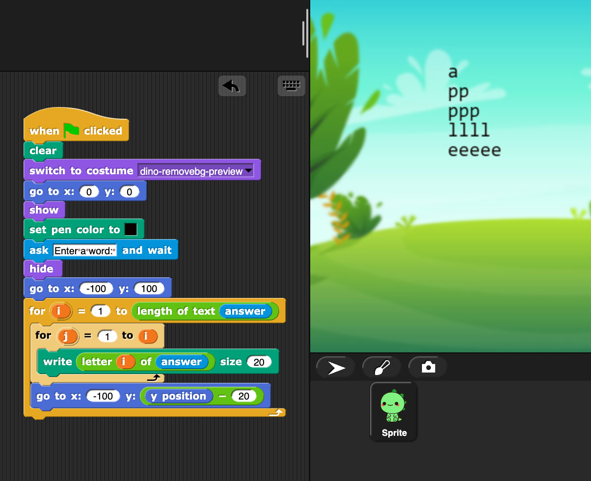

=======================================
Chapter 4: Conditionals and Loops
=======================================

*Chapter written by Chloe Nguyen*

In the previous chapters, you have explored how to map from Snap code into Python, SQL, and HTML code.  The idea is to make sense of textual programming language based on what you know from Snap.

In this chapter, we reverse the process. We are going to start with two key ideas in programming languages (textual or block-based): Conditionals and loops. We use both Snap and Python to provide examples.

Section 1: Conditionals
::::::::::::::::::::::::::::

Conditionals are also known as *if clauses* and we use them all the time to express that one thing depends on something else. This idea transfers to programming.

Let's start with the "if" statement. If you ask someone how their day is, your answer depends on their response. You wouldn't say "Yay!" if someone told you that they had a bad day (hopefully). You would only say "Yay!" if someone says they are "Good."

Then there is the "else if" statement. Let's say you checked for "Good," but did not find it. Give yourself another option! Check for "Bad," which you could answer with something positive (e.g. "Oh no, at least we beat OSU in hockey"). 

Finally, there is the "else" clause. You check and the answer is not "Good" or "Bad," so you make a "catch-all" answer for any other response. 

The Snap Version
--------------------

Here is a `simple dialog project <https://snap.berkeley.edu/project?username=chloeejnguyen&projectname=example1>`_ that shows the logic from above.  Here's what it looks when running.

The Python Version
--------------------

The below program does the same thing in Python.  Click 'Run' to have a conversation.

.. activecode:: ifstatements
   :language: python

   answer = input('Hello! How are you?')
  
   if 'Good' in answer:
      print('Yay!')
   elif 'Bad' in answer:
      print('Oh no, at least we beat OSU in hockey :)')
   else:
      print('I do not know how to respond to that.');

Let's look at this syntax. The first if statment is checking to see if the word "Good' is in the answer, which was input from the user. "Elif" stands for else if and checks for "Bad" in the answer as long as "Good" was not found. Finally, "else" tells the user that the computer has no idea how to respond to what the user inputted.

.. mchoice:: PyIf1-answer
    :correct: c
    :answer_a: A built-in (like in Snap) that contains what the user types.
    :answer_b: A special variable that prompts the user for input.
    :answer_c: Just a variable containing a string.
    :answer_d: A number representing the number of characters typed
    :feedback_a: No, answer is not built-in here.
    :feedback_b: No, that's what the function input() does.
    :feedback_c: Yes, answer is a variable that contains the string input by the user.
    :feedback_d: No, it is a string returned by input().

    What is *answer* in the above code?

.. mchoice:: PyIf2-answer
    :correct: a
    :answer_a: Yay!
    :answer_b: Oh no, at least we beat OSU in hockey :)
    :answer_c: I do not know how to respond to that.
    :feedback_a: Yes, because the program looks for 'Good' anywhere in the input
    :feedback_b: No, that only happens if 'Bad' is in the input
    :feedback_c: No, the input has 'Good' in it.

    What gets printed if you input to the above program "It was a Good Day!"?

.. mchoice:: PyIf3-answer
    :correct: c
    :answer_a: Yay!
    :answer_b: Oh no, at least we beat OSU in hockey :)
    :answer_c: I do not know how to respond to that.
    :feedback_a: No, because the program looks for 'Good' anywhere in the input, and the capital G is critical
    :feedback_b: No, that only happens if 'Bad' is in the input
    :feedback_c: Yes, the input has 'good' in it and not "Bad" or "Good.""

    What gets printed if you input to the above program "It was a good day!"?

Another Example
--------------------
Do you know when you sign up for a new account and have to enter your birthday? Some websites have you put a number for your month, others give you a drop down menu, and still others show a calender. Here is a simple `Snap project for converting months <https://snap.berkeley.edu/project?username=chloeejnguyen&projectname=example2>`_ that takes in a number and gives your birth month. Note that instead of an "else if" statement, Snap just has you put an if statement inside of another one. It works the same way! The first if statement is checked before the second one, the second before the third, and so on.

The below program does the same thing in Python.  Click 'Run' to try it out.

.. activecode:: IfStatements1
   :language: python
   
   number = int(input('What month were you born?'))
   
   if number > 12 or number < 1:
      print('That is not a valid month.')
   elif number == 1:
      print('January')
   elif number == 2:
      print('February')
   elif number == 3:
      print('March')
   elif number == 4:
      print('April')
   elif number == 5:
      print('May')
   elif number == 6:
      print('June')
   elif number == 7:
      print('July')
   elif number == 8:
      print('August')
   elif number == 9:
      print('September')
   elif number == 10:
      print('October')
   elif number == 11:
      print('November')
   else:
      print('December');

Try answering these questions about the Python code above.

.. mchoice:: PyIf1
    :correct: c
    :answer_a: February
    :answer_b: I do not know how to respond to that.
    :answer_c: That is not a valid month.
    :answer_d: December
    :feedback_a: No, February only outputs if number is equal to 2.
    :feedback_b: No, there is not a print out statement with that phrase anywhere in the code.
    :feedback_c: Yes, exactly right.
    :feedback_d: No, that is the "catch-all" statement, but an if statement is satisfied before the computer gets to else.

     What is outputted if the input is "14"?

.. mchoice:: PyIf2
    :correct: d
    :answer_a: No reason, order doesn't matter.
    :answer_b: If they did not check that the input was an number between 1-12, December would be outputted even when input is "-1".
    :answer_c: There would be no point checking what month the input corresponded to if the input was not a number between 1-12.
    :answer_d: Both B and C.
    :feedback_a: No, think about time. Would it be faster to go through 12 lines of code or just 1?
    :feedback_b: Yes, kind of right. What else is right?
    :feedback_c: Yes, kind of right. What else is right?
    :feedback_d: Yes, exactly right.

     Why do you think the programmer checked that it was a valid month first?

.. mchoice:: PyIf3
    :correct: c
    :answer_a: It would have to check if that day was possible for that month. 
    :answer_b: It would have to check if that day was possible for that month for that year. 
    :answer_c: All of the above.
    :feedback_a: Yes. Only 28 days in February, but 31 in March.
    :feedback_b: Yes. Leap year! Now there are 29 days in February.
    :feedback_c: Yes, exactly right.
    
     How would this program change if you were doing days?

.. mchoice:: PyIf-error
    :correct: a
    :answer_a: Because we try to change the input() into an integer with int(), and you can't change a month name into an integer.
    :answer_b: Python is broken.
    :answer_c: It works if you use lower-case characters.
    :answer_d: Because the variable *number* can only be a number.
    :feedback_a: Yes. input() returns a string, and int() changes that into a number, if it can.
    :feedback_b: No, not in this case.
    :feedback_c: No, characters can't be changed into numbers.
    :feedback_d: No, the variable *number* can actually hold a string or a number. The word doesn't matter.

    What happens if you type a month name, like 'September'?  Try it. You get an error. Why?

Section 2: Loops
::::::::::::::::::::::::::::

Loops are exactly what they sound like, doing the same thing again and again. There are several different types of loops, but we are going to focus on the for loop. A for loop is used when you know how many times you have to do something. 

For example, imagine making a circle in Snap. You would move a few steps forward and then turn. And then repeat that a bunch of times. Let's say you turned 1 degree every time, you would repeat the process 360 times to get a circle!

The Snap Version
--------------------

Here is a `project <https://snap.berkeley.edu/project?username=chloeejnguyen&projectname=example3>`_ that takes in a word from the user and makes a right triangle out of the letters! Try "apple" as in this example, or another word like "dinosaur."

This program has two loops.  The one counts *i* from 1 to the length (in characters) of the input *answer*.  The interior loop counts *j* from 1 to the value of *i*. Inside that, we write the letters of the answer.  So the first time through the loop, i is 1 and j is 1, so we print just one letter. In the second time, i is 2 and j is 1 and then 2.  Third time, i is 3 and j is 1, then 2, then 3.  We use j to reference the character that gets written on the screen.

The Python Version
--------------------

Let's start with a simplified version in Python.

.. activecode:: ForLoops1
   :language: python
   
   word = input('Enter a word: ')
   
   length = len(word);
   
   for i in range(length):
    print(word[i], end = '')

Now this code does not do the exact same thing yet. Let's walk through it
  - takes in a word from the user, e.g. apple
  - finds the length of the word, e.g. 5
  - makes a for loop that runs 5 times
  - outputs word[i]

How do we know that we loop around 5 times? The line "for i in range(length):" creates a for loop that goes around "length" number of times doing whatever is after the colon. We start with that variable i equal to 0 and print something out. The next time around, i = 1 and something is printed out (and so on).

If the word is apple, length is equal to 5. The for loop goes until the value of i is equal to or greater to whatever number is inside range(). With that logic, the loop STOPS when i goes to 5. That means it outputs something for i = 0, 1, 2, 3, 4. Or, in other words, goes around 5 times.

What are we printing? The variable "word" is the word that the user gave us. The phrase "word[i]" gives us a letter from the word. If i = 0, it would be 'a.' If i = 1, it would be 'p.' If i = 2, it would be 'p.' If i = 3, it would be 'l.' If i = 4, it would be 'e.'

Try answering this question about the Python code above.

.. mchoice:: PyIf-loop1
    :correct: c
    :answer_a: Yes, "applee."
    :answer_b: Yes, "applea."
    :answer_c: No.
    :feedback_a: No, the word apple does not have a sixth letter so word[5] would give an error!
    :feedback_b: No, the word apple does not have a sixth letter so word[5] would give an error!
    :feedback_c: Yes, exactly right.

     If the word is apple, would a for loop that has range(6) work? If so, what would the output be?

Here is the Python code that matches the Snap project above.

.. activecode:: ForLoops2
   :language: python
   
   word = input('Enter a word: ')
   
   length = len(word);
   
   for i in range(length):
    for j in range(i+1):
       print(word[i], end = '')
    print()

Now there are two for loops and we have our right triangle. Here a few hints about how this works:    
  - once the first for loop is entered, the second for loop is entered and runs COMPLETELY (j = 1, j = 2, j = 3,...) before the first for loop "loops"
  - i changes every time! that means the number of times the second for loop "loops" also changes every time
  - when i = 0, j runs once
  - when i = 1, j runs twice
    
 
 Try answering these questions about the Python code above.

.. mchoice:: PyFor1
    :correct: c
    :answer_a: 5 times
    :answer_b: 6 times
    :answer_c: 3 times
    :feedback_a: No, what is the range?
    :feedback_b: No, what is the range?
    :feedback_c: Yes, exactly right. i + 1 = 3

     If i = 2, how many times will the second for loop "loop"?
     
     
    
.. mchoice:: PyFor3
    :correct: a
    :answer_a: Prints new line, first for loop.
    :answer_b: Prints new line, second for loop.
    :answer_c: Prints space, first for loop.
    :answer_d: Prints space, second for loop.
    :feedback_a: Yes, exactly right.
    :feedback_b: No, think about where it is indented.
    :feedback_c: No, think about when a space is needed. After we change to the next letter in the word or after a letter is repeated?
    :feedback_d: No, think about where it is indented.

     What do you think print() does? And what for loop does it belong to?

.. mchoice:: PyFor4
    :correct: c
    :answer_a: print(word[length-i], end = '')
    :answer_b: print(word[i+j], end = '')
    :answer_c: print(word[(length-1)-i], end = '')
    :feedback_a: No. When i=0, we are left with word[length]. For apple, word[5] does not exist, as word[0] is 'a' and word[4] is 'e'.
    :feedback_b: No. The value of j changes, so there would be different letters on the same line.
    :feedback_c: Yes, exactly right. 
    
     If you wanted to make a right triangle of the word's letters in BACKWARD order, what would you replace "print(word[i], end = '')" with?
     
