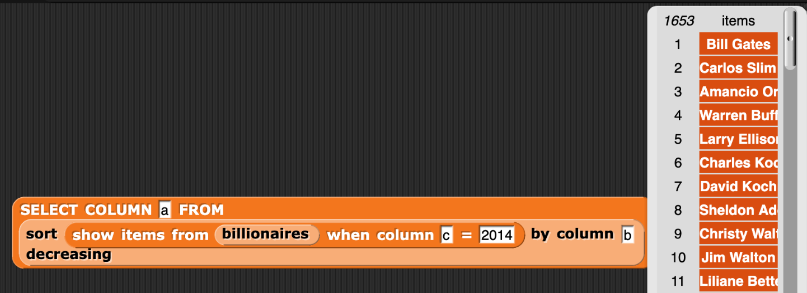

=======================================
Chapter 3: Tables of Data
=======================================

In this class, we started out talking about how characters were represented on the computer, and how that choice (e.g., between ASCII and Unicode) can be a barrier to some people's access to computing. We considered how computers might recognize and generate sentences, and about the challenges of understanding different dialects of English with the same language model. We then moved to the Internet and the Web, tracing its history and how grounded it was in English and male culture (e.g., the history of BASIC at Dartmouth). We wrote programs to pull data out of the Web (e.g., pulling out URLs and web-scraping) and to generate HTML for the Web. In this last section of the course, we have written programs to analyze data from the Web.

Section 1: CSV Files
::::::::::::::::::::::::::::::::

In this class, we have been writing Snap programs to take apart and analyze CSV files.

.. image:: figures/picking-words-from-variables.png

The Python Version V1
----------------------

The below program does the same thing in Python.  Click 'Run' to generate a random sentence.

.. activecode:: pysentencegen
   :language: python
   
   import random
   
   nouns = ["dog","cat","bat"]
   verbs = ["jumps", "runs", "shouts"]
   adverbs = ["slowly", "quickly", "lazily"]
   articles = ["The","A"]
   
   noun = random.choice(nouns)
   verb = random.choice(verbs)
   adverb = random.choice(adverbs)
   article=random.choice(articles)
   
   print(article,noun,verb,adverb)

Try answering these questions about the code above.

.. mchoice:: PyGen1
    :correct: a
    :answer_a: They are both variables. `nouns` is a list of nouns, and `noun` is a randomly chosen noun
    :answer_b: Just the `s`.  They mean the same thing.
    :answer_c: Both are variables, which hold data in Python
    :feedback_a: Yes, exactly right.
    :feedback_b: No, the names of the variables are just chosen to inform the reader.
    :feedback_c: That's true, but that doesn't get at the purpose of the words.

    What's the difference between `nouns` and `noun` above?

.. mchoice:: PyGen1_2
    :correct: c
    :answer_a: Tells Python that it is going to make a choice among these items
    :answer_b: Creates a variable
    :answer_c: Define a list, like our multiline or list blocks in Snap.
    :feedback_a: No -- the choice comes later
    :feedback_b: No, the variable name with `=` does that.
    :feedback_c: That's right.

    What do you think the square brackets [] do in the above Python code?

.. mchoice:: PyGen1_3
    :correct: c
    :answer_a: It generates a random number
    :answer_b: It's a fairly arbitrary variable name
    :answer_c: It's the name of the library that contains the function `choice`
    :feedback_a: No -- the random library can generate a random number, but that's not what random means
    :feedback_b: No, it's pre-defined in Python.
    :feedback_c: That's right.

    Take a guess what the word `random` is above?

Section 2: Using SQL to Process Databases
::::::::::::::::::::::::::::::::::::::::::::

You have built Chatbots in both Snap! and Charla-bots.
Here's an example on a little one:

Here is a (very) little Python chatbot.  This one is a little more sophisticated than our Snap chatbot -- it can pick out a name from an input sentence, and it can do the equivalent of **respond randomly** that we saw in Charla-bot.

Python here in a Runestone ebook can't receive user input, so let's just change the `inputSentence` variable to represent
what the user says. Press Run to see what the chat bot says.

.. activecode:: sql1
   :language: sql
   :dburl: billionaires.db

   select name
   from billionaires 
   where year=2014 and rank<10;

.. mchoice:: PyGen3_1
    :correct: a
    :answer_a: Checks to see if the input sentence has the word "name" in it.
    :answer_b: Puts the word "name" into the output
    :answer_c: Asks the user what their name is
    :feedback_a: Exactly. `wordsInSentence` is the list of words in the input sentence
    :feedback_b: No, output is generated with print()
    :feedback_c: No, nothing here does that.

    What do you think `if "name" in wordsInSentence` does?

.. mchoice:: PyGen3_2
    :correct: b
    :answer_a: Lists the questions that the user might ask.
    :answer_b: Provide possible responses like *respond randomly* in Charla-bots.
    :answer_c: Makes it possible for the computer to respond to questions.
    :feedback_a: No, that isn't happening here.
    :feedback_b: Exactly. Each question is a like another line in *respond randomly*.
    :feedback_c: No, those aren't questions that the computer can respond to.

    What do you think the variable `questions` is doing?

.. mchoice:: PyGen3_3
    :correct: b
    :answer_a: How are you?
    :answer_b: Hey, Sup
    :answer_c: Hola, Dude
    :feedback_a: No, that doesn't contain any of the words in `greetings`
    :feedback_b: Yes, because "Sup" is in `greetings`.
    :feedback_c: No, that sentence doesn't contain any of the words in `greetings`

    Which of these `inputSentence` options (and you're welcome to try them!) would generate the chatbot saying "Hi, how are you?"

.. mchoice:: PyGen3_4
    :correct: a
    :answer_a: True
    :answer_b: False

    `found` in this program is just a variable, that could be named anything, but it's purpose is to track if we found a greeting word.

