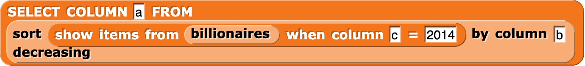
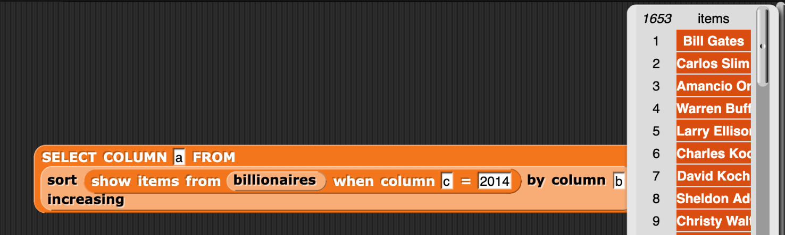
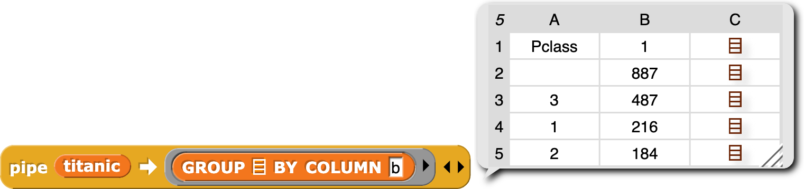
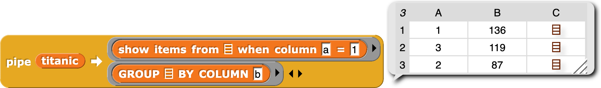
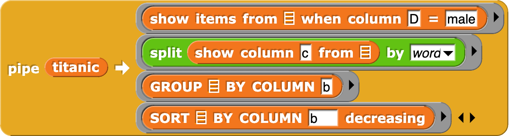

=======================================
Chapter 3: Tables of Data
=======================================

In this class, we started out talking about how characters were represented on the computer, and how that choice (e.g., between ASCII and Unicode) can be a barrier to some people's access to computing. We considered how computers might recognize and generate sentences, and about the challenges of understanding different dialects of English with the same language model. We then moved to the Internet and the Web, tracing its history and how grounded it was in English and male culture (e.g., the history of BASIC at Dartmouth). We wrote programs to pull data out of the Web (e.g., pulling out URLs and web-scraping) and to generate HTML for the Web. In this latest section of the course, we have written programs to analyze data from the Web.

Section 1: Billionaires
::::::::::::::::::::::::::::::::

In this class, we have been writing Snap programs to take apart and analyze CSV files. In this ebook, we'll be using the databases and blocks found in the `Database Microworld with Titanic <https://snap.berkeley.edu/project?username=guzdial&projectname=Database%20Microworld%20with%20Titanic%20for%20Ebook>`_ project.  For example, here's a script that selects the billionaires from 2014, sorts those billionaires in terms of their rank (in column B), then selects just the names.

The list is long -- 16543 names.  We can get Snap to show us all of them. Here's what the top of that list looks like.

We can also describe the same script as a `pipe` where the billionaires are first selected, then sorted, and then the names selected out.

The SQL Version
------------------

In the database world, these kinds of queries are typically written in `SQL <https://en.wikipedia.org/wiki/SQL>`_, which stands for `Structured Query Language`.  SQL is a domain-specific languages for managing data in tables.  A database table is different than a CSV file.  One difference is that columns in a database table usually have a type.  You might store numbers in one column, dates in another, and text in yet another. Once set up, you may not put text in a column that can only hold numbers.  Click 'Run' to generate a random sentence.

Database tables can be set up to have indices. An index (which can be one variable or a set of variables) should be unique for each row of a database. For example, an ID number associated with a customer or office could be an index. Access via an index is especially fast, much faster than searching the CSV table for information.

Here is the SQL code that does the same thing as the Snap programs above. Click the Run button to execute it.

.. activecode:: sql1
   :language: sql
   :dburl: /_static/billionaires.db

   select name
   from billionaires 
   where year=2014 and rank<10;

Try answering these questions about the code above.

.. mchoice:: Sql1star
    :correct: b
    :answer_a: It's an error.
    :answer_b: You get all columns, not just name.
    :answer_c: You multiply all the values together.
    :feedback_a: No, it will work.
    :feedback_b: Yes, asterisk means to match all of the column names.
    :feedback_c: No, it's not about mathematics.

    What do you think will happen if you replace name by * above? (Yes, it's completely fine to go ahead and TRY it.)

.. mchoice:: Sql1noyear
    :correct: c
    :answer_a: You'll get an error because you have to specify a year.
    :answer_b: You'll get an error because you need to always use AND in a WHERE clause.
    :answer_c: You'll get the top 9 rankings from every year in the database.
    :feedback_a: No -- in fact, you don't have to have a WHERE clause at all.
    :feedback_b: No, you can use AND or OR, or neither.
    :feedback_c: Exactly right -- try it!

    What will happen if the last line was just `where rank<10;` (no year)?

.. mchoice:: Sql1NoTable
    :correct: c
    :answer_a: It will run the query across all tables in the database.
    :answer_b: The table billionaires will be assumed.
    :answer_c: You will get an error.
    :feedback_a: No, the table name must be specified.
    :feedback_b: No, because you might have two tables in use (e.g., for a join)
    :feedback_c: Yes, the error is `no tables specified.` (But you probably tried that and found out already.)

    What happens if you delete line 2?

Section 2: Titanic
::::::::::::::::::::::

You may remember that we also did several analyses with the list of passengers on the Titanic.  For example, here is a grouping by passenger class.  This is how many there were in each class:

In this second example, we can first select by whether or not the passengers survived, and then group by class.

Computing the average for each class is left for you to do.

Here are each of these analyses, in SQL. Press `Run` to execute each of them.

The SQL Versions
------------------

.. activecode:: sqlt1
   :language: sql
   :dburl: /_static/titanic.db

   select count(name),pclass 
   from titanic 
   group by pclass;

.. activecode:: sqlt2
   :language: sql
   :dburl: /_static/titanic.db

   select count(name),pclass 
   from titanic 
   where survived=1
   group by pclass;

Here are some questions about each of these:

.. mchoice:: SQLt1name
    :correct: b
    :answer_a: It's the index value for this database.
    :answer_b: It's likely unique.
    :answer_c: You must always count something when grouping
    :feedback_a: Maybe it could be, but it isn't here.
    :feedback_b: That is why we did it.
    :feedback_c: It's not strictly necessary, but if you don't, you just get one name per class.  Try it!

    Why are we counting name?

.. mchoice:: PyGen3_2
    :correct: a
    :answer_a: True
    :answer_b: False.
    :feedback_a: Not really.  This is a count of the number of parties on the Titanic.
    :feedback_b: Right. If you look, each row has the number of adults and children. Besides, we can't be sure that the passenger list is right since some people may have got off before crossing the Atlantic.

    True or False: This is a count of the number of people on the Titanic.

Names on the Titanic
---------------------

One of the more interesting analyses that we did with the Titanic data was to look at the most common first names of men vs. women.

This turns out to be much more difficult in SQL.  SQL can generate substrings, but it can't easiliy split by word. The Snap version is splitting by wording, then grouping and sorting the result. 

Here's an example that's getting close -- picking out the first three characters from all male names on the Titanic.

.. activecode:: sqlt3
   :language: sql
   :dburl: /_static/titanic.db

   select substring(name,1,3)
   from titanic 
   where sex="male";

Now, we can see adults ("Mr.") vs children ("Mas" for "Master").  But there's not an easy way of getting the second `word`.

.. mchoice:: SQLT3semi
    :correct: a
    :answer_a: Yes, it's required.
    :answer_b: Yes, but it's optional.
    :answer_c: No, you could leave it out.
    :feedback_a: Right, because you could have several SQL statements in a single query.
    :feedback_b: No, it's required.
    :feedback_c: Try it -- it won't work right.

    Is that semi-colon at the end really necessary?

.. mchoice:: SQLT3programming
    :correct: a
    :answer_a: True
    :answer_b: False
    :feedback_a: Strictly speaking, it is. It's considered a domain-specific language.
    :feedback_b: It is a programming language, but it can't do much. It's considered a declarative language because you declare what you want.

    True or False: SQL is a programming language.

