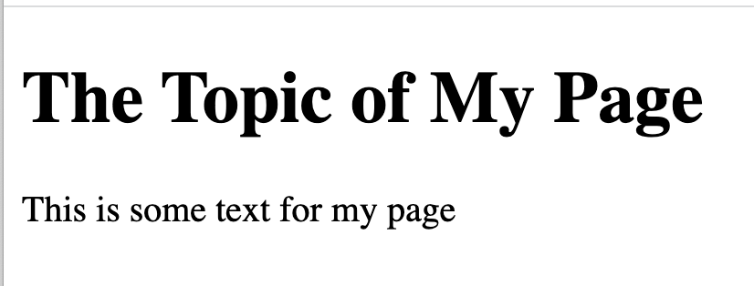
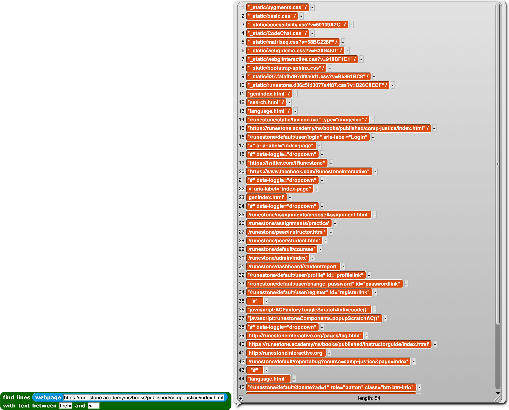

=======================================
Chapter 2: HTML
=======================================

Section 1: Generating HTML
::::::::::::::::::::::::::::

We have generated HTML using our `Web Microworld blocks <https://snap.berkeley.edu/project?username=guzdial&projectname=web%20microworld%20with%20scraping%20%2d%2011Oct>`_ in Snap.  For example, here's a very tiny web page definition in Snap blocks.

.. image:: figures/simple-web-page-blocks.png

This generates a page that looks like this

The Snap stage shows us the HTML that was generated for this page.  Remember this -- we'll compare to it later.

.. image:: figures/simple-web-page-stage.png

The Python Version
--------------------

Here is a Python program that does the exact same thing as the Snap blocks above.  Click "Run" to see the HTML that this generates.

.. activecode:: HTMLgen
   :language: python
   
   def header(num,text):
      return "<h"+str(num)+">"+text+"</h"+str(num)+">"

   def paragraph(text):
      return "
"+text+"
"

   webpage = "<body>"
   webpage=webpage+header(1,"The Topic of My Page")
   webpage += paragraph("This is some text for my page.")
   webpage += "</body>"
   print(webpage)

The execution of this program looks pretty similar to what appears on the stage. Both the Snap and Python programs generate the same HTML. They are doing the same tasks.

The Python code might look longer and more complicated, but part of that is because of *abstraction*.  We gave you a set of blocks that hides some of the details.  Here is what is inside the "Make a Heading" block.  Looks pretty close to the start of the Python program, isn't it?  The block hides away a lot of the detail and complexity -- that's *abstraction*.

.. image:: figures/make-a-heading-level.png

Let's go through how this works:

- We are defining two functions using `def`. That is the keyword in Python for defining functions. One function is for creating headers. The other is for creating paragraphs.  We use "+" to combining strings, like `join` in Snap.
- We are building the HTML for our webpage in the variable `webpage`.
- Instead of `webpage = webpage +`, Python gives us a short form: `webpage +=` that adds something to the end of the `webpage` variable.
- At the end, we print the HTML in the variable `webpage`.

Try answering these questions about the Python code above.

.. mchoice:: PyHTML1
    :correct: a
    :answer_a: webpage += header(2,"Here is more Information")
    :answer_b: webpage += header2("Here is more Information")
    :answer_c: header(2,"Here is more Information")
    :answer_d: &lt;h2&gt;Here is more Information&lt;/h&gt;
    :feedback_a: Yes, exactly right.
    :feedback_b: No, there is no function `header2`. The function name is `header` and it takes two inputs: A heading level and text for the heading, in that specific order..
    :feedback_c: No, that calls `header` funciton but does not insert it into the webpage.
    :feedback_d: No, that is the HTML we want to generate. That is not valid Python code.

    If you wanted a second level heading that said "Here is More Information," you would insert it right after line 9. which line of Python code would you insert?  (Feel free to try it to see which works.)

.. mchoice:: PyHTML2
    :correct: b
    :answer_a: Tells Python that we are going to create a Webpage
    :answer_b: Creates a variable named webpage and puts the text for body in it.
    :answer_c: Declares the variable webpage to have type body
    :answer_d: Creates a string variable named webpage
    :feedback_a: No, Python doesn't know what a webpage is.
    :feedback_b: Yes. No declaration is needed.
    :feedback_c: No, there is no type named "body"
    :feedback_d: Kind of -- it creates as a "string" variable by putting a string in the variable.

    What does webpage = "<body>" do?

.. mchoice:: PyHTML3
    :correct: a
    :answer_a: Indentation - the lines indented under def are part of the definition.
    :answer_b: Curly braces and semi-colons, like in Java or C.
    :answer_c: Machine learning.
    :feedback_a: Yes. It's an odd feature of Python.
    :feedback_b: No, there are no curly braces or semi-colons in this example.
    :feedback_c: No, indentation tells Python how the code is structured.

    How does Python know what lines of Python code are inside the function definitions for header() and paragraph()?

Section 2: Scraping HTML
::::::::::::::::::::::::::::

We built a set of blocks in Snap `Web Microworld blocks <https://snap.berkeley.edu/project?username=guzdial&projectname=web%20microworld%20with%20scraping%20%2d%2011Oct>`_ that allow us to pull the content out of Web pages and *scrape* that content.  That is, we figure out what parts we want and return it.

Here, we grab all the URLs from this website, where the ebook is located.

The result looks like this:

The Python Version
--------------------

Here is a Python program that does the exact same thing as the Snap blocks above.  Click "Run" to see what it generates.

.. activecode:: HTMLscrape
   :language: python
   
   import requests

   def web_scraper(url):       
    reqs = requests.get(url)
    for string in reqs.text.split():
        if "href" in string:
            link=string.lstrip('href=')
            print (link)

   web_scraper('https://runestone.academy/ns/books/published/comp-justice/index.html')

Let's go through how this works:

- We are loading a library called `requests` which gives us the ability to read URLs.
- We are defining a function `web_scraper` that takes a URL, then we `get` the content. That content is split into parts. We look for "href" in the part, then strip away the "href=".  We print what's left.
- The very last line is the one that calls the function `web_scraper` on this website.

Try answering these questions about the Python code.

.. mchoice:: Pyscrape1
    :correct: a
    :answer_a: True. Library names are up to the user.
    :answer_b: False. Library names are specific and must be typed exactly.
    :feedback_a: No. You can call your own libraries and your own variables and functions whatever you want. Python's libraries must be named as specified.
    :feedback_b: Yes, Python is particular about how its libraries are called.

    The first line "import requests" is relatively arbitrary.  We could change it to "import my requests" and it would still work. (Go ahead and try it!)

.. mchoice:: Pyscrape2
    :correct: b
    :answer_a: True. Function names are defined by the programmer.
    :answer_b: False. This is web scraping, so it must be called web_scraper.
    :feedback_a: Yes. Function names should be understandable, start with a letter, and follow a few other restrictions. But could be just about anything.
    :feedback_b: No, it's really up to the programmer.

    The function `web_scraper` in line 3 could be anything, as long as we match it to the function call in line 10.

.. mchoice:: Pyscrape3
    :correct: b
    :answer_a: reqs is defined in the library requests, and it sets the library to only work with split text.
    :answer_b: reqs is a variable defined in line 4. reqs.text returns the text of the URL, and split() chops it into pieces.
    :answer_c: reqs.text.split() means "Split up the words and go through each one."
    :feedback_a: No, reqs is a variable that was defined in line 4.
    :feedback_b: Exactly right. reqs is defined by the programmer.
    :feedback_c: No, the "for string in" part is what starts going through each piece. reqs.text.split() generates the pieces for the variable "string" to be set to.

    What is reqs.text.split() doing?

.. mchoice:: Pyscrape4
    :correct: c
    :answer_a: lstrip is short for link strip, and it strips the link from the HTML.
    :answer_b: lstrip is for Larry's strip, which is defined for Larry Page of Google -- it's his favorite function.
    :answer_c: It removes the given string "href=" from the variable "string" starting at the left (hence Lstrip)
    :feedback_a: No, Python doesn't know what a link is.
    :feedback_b: No, I have no idea what Larry Page's favorite Python function is.
    :feedback_c: Exactly right -- this is how we get what the href= points at.

    What does lstrip('href=') do?

Section 3: Reading HTML
::::::::::::::::::::::::::::

You have built HTML pages, and seen the HTML that gets generated by the blocks.  Below are Parsons Problems.  For each of these, we give you the HTML, but scrambled.  Drag them into the right order, then press the "Check" button to see if you got it right.

.. parsonsprob:: html_pp_ex1
   :noindent:
   :adaptive:
   :numbered: left

   Put the blocks into order to define a simple HTML page. The Head comes before the Body, and the Title is inside the Head.
   -----
   &#60html lang="en"&#62
   =====
       &#60head&#62
   =====
           &#60title&#62My First Page&#60/title&#62
   =====
       &#60/head&#62
   =====
       &#60body&#62
   =====
           &#60p&#62This should be displayed by the browser.&#60/p&#62
   =====
       &#60/body&#62
   =====
   &#60/html&#62

.. parsonsprob:: html_pp_ex2
   :adaptive:
   :noindent:
   :numbered: left

   Put the blocks in order to create an HTML page with a body that contains an H2 header, a paragraph, and a link to another page. Only one of the H2 links below is correct -- pick the right one, please.
   -----
   &#60;html&#62;
   =====
       &#60;body&#62;
   =====
           &#60;h2&#62;HTML Links&#60;/h2&#62;
   =====
           &#60;h2&#62;HTML Links #paired
   =====
           &#60;p&#62;HTML links are defined with the a tag:&#60;/p&#62;
   =====
           &#60;a href="https://www.w3schools.com"&#62;This is a link&#60;/a&#62;
   =====
       &#60;/body&#62;
   =====
   &#60;/html&#62;

.. parsonsprob:: htmlp3
   :adaptive:
   :numbered: left

   Put the blocks into order to define a simple HTML page. Indent the blocks to show the structure. Note that the "head" comes before the "body" and the title is defined in the head. The body should contain a paragraph with a link in it.
   -----
   &#60html lang="en"&#62
   =====
       &#60head&#62
   =====
           &#60title&#62HTML Tutorial&#60/title&#62
   =====
       &#60/head&#62
   =====
       &#60body&#62
   =====
           &#60p&#62This is a paragraph with a link in it. 
   =====
               &#60a href="https://www.python.org"&#62Python&#60/a&#62
   =====
               &#60a href="Python"&#62"https://www.python.org"&#60/a&#62 #paired
   =====
           &#60/p&#62
   =====
       &#60/body&#62
   =====
   &#60/html&#62

